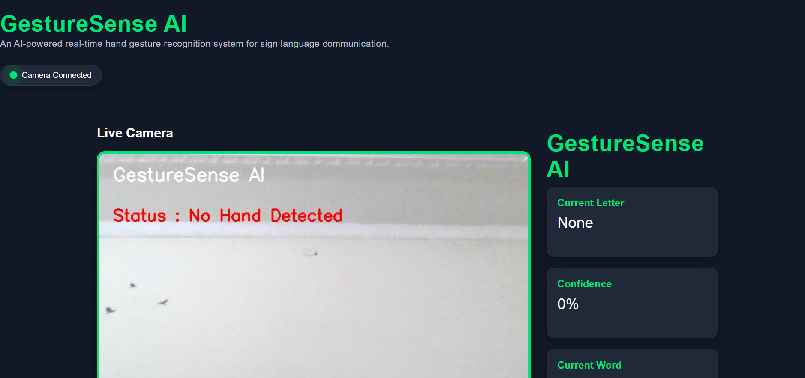
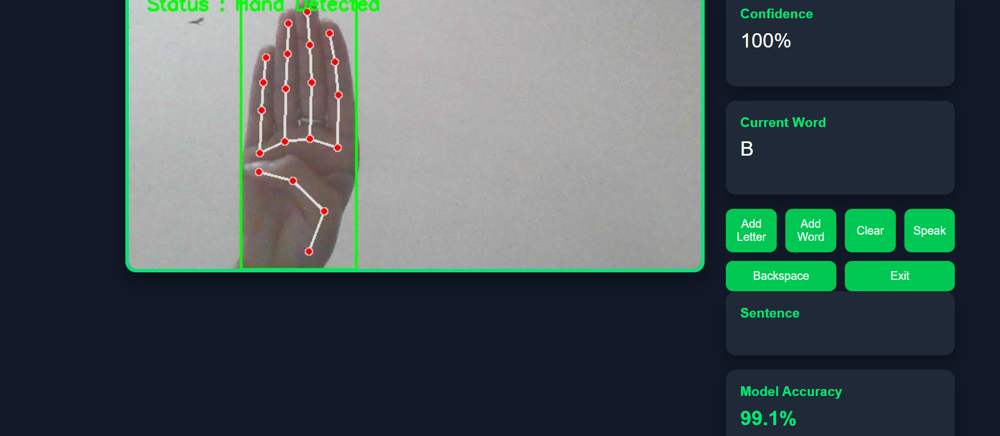

# 🤖 GestureSense AI

An AI-powered real-time Sign Language Recognition system that detects hand gestures using **MediaPipe**, classifies them using a **Machine Learning (MLP) model**, and provides an interactive web interface built with **Flask**.

---

## 📌 Project Overview

GestureSense AI is designed to recognize American Sign Language (ASL) alphabet gestures in real time using a webcam.

The system extracts 3D hand landmarks using Google's MediaPipe framework and predicts the corresponding alphabet using a trained Machine Learning model. Users can build words and sentences, hear them through Text-to-Speech, and interact with the system through a modern web interface.

---

## ✨ Features

- 🔤 Real-time ASL alphabet recognition (A–Z)
- 🤖 Machine Learning based gesture classification
- ✋ Hand landmark detection using MediaPipe
- 📷 Live webcam streaming
- 📊 Confidence score display
- 📝 Word and sentence builder
- 🔊 Text-to-Speech conversion
- 🌐 Flask-based web application
- 🎯 Stable prediction using prediction buffering
- ⚡ Real-time performance with FPS display

---

## 🛠️ Tech Stack

### Programming Language
- Python

### Machine Learning
- Scikit-learn (MLP Classifier)

### Computer Vision
- OpenCV
- MediaPipe

### Web Framework
- Flask

### Libraries
- NumPy
- Pandas
- Joblib
- pyttsx3

### Frontend
- HTML
- CSS
- JavaScript

---

## 📂 Project Structure

```
GestureSenseAI/
│
├── app.py
├── config.py
├── requirements.txt
├── README.md
│
├── models/
│   └── gesture_model.pkl
│
├── dataset/
│
├── preprocessing/
│
├── training/
│
├── prediction/
│
├── utils/
│   └── predictor.py
│
├── static/
│   ├── css/
│   ├── js/
│   └── images/
│
└── templates/
    └── index.html
```

---

## ⚙️ Installation

Clone the repository

```bash
git clone https://github.com/OshinSaini26/GestureSenseAI.git
```

Move into the project directory

```bash
cd GestureSenseAI
```

Create virtual environment

```bash
python -m venv .venv
```

Activate virtual environment

Windows

```bash
.venv\Scripts\activate
```

Install dependencies

```bash
pip install -r requirements.txt
```

Run the application

```bash
python app.py
```

Open your browser

```
http://127.0.0.1:5000
```

---

## 📸 Application Screenshots

### Home Page



---

### Gesture Recognition



---

### Web Interface


---

## 🧠 Machine Learning Workflow

1. Collect hand landmark dataset using MediaPipe
2. Save landmark coordinates into CSV files
3. Preprocess and combine the dataset
4. Train an MLP Classifier using Scikit-learn
5. Save the trained model using Joblib
6. Load the model in Flask
7. Predict gestures in real time

---

## 📊 Dataset

- Total Classes: **26**
- Total Samples: **14,614**
- Features per Sample: **63**
- Landmark Detection: **MediaPipe Hands**

---

## 🚀 Future Improvements

- Support complete ASL words
- Dynamic gesture recognition
- Sentence auto-correction
- Speech-to-Sign translation
- Deploy on Render
- Mobile-friendly interface
- Multi-hand detection

---

## 👨‍💻 Author

**Oshin Saini**

B.Tech Computer Science Engineering

Guru Nanak Dev University, Amritsar

GitHub:
https://github.com/OshinSaini26

---

## ⭐ If you like this project

Give this repository a ⭐ on GitHub.
